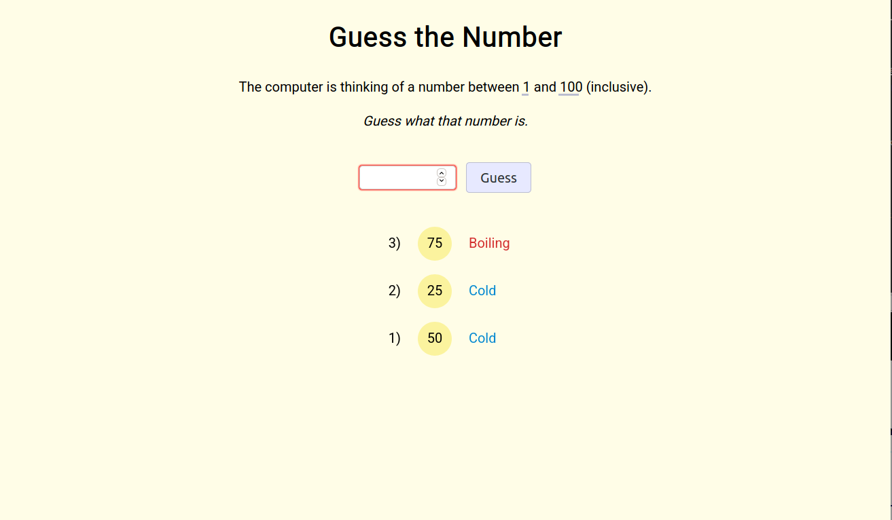

# Guess the Number
> A game where you guess the number, but it tells you how warm you are, rather than higher or lower

## Table of contents
* [General info](#general-info)
* [Screenshots](#screenshots)
* [Technologies](#technologies)
* [Learnings](#learnings)
* [Setup](#setup)
* [Features](#features)
* [Status](#status)
* [Contact](#contact)

## General info
A standard guess the number between 1 and 100 game. However, it won't tell you whether your guess is higher or lower but how hot/cold it is based on how close you are. I wrote this in order to practise unit testing.

## Screenshots

## Technologies
* HTML
* SCSS
* jQuery
* Parcel
* Jest
* Cypress

## Learnings
* CSS pseudo elements
* CSS animation
* Adding DOM elements with JavaScript
* Testing with Jest
* End to end testing with Cypress
* Accessibility testing with Cypress

## Setup
To view this project visit the [demo](https://click-the-shape.nicm42.co.uk/) or download the files and open index.html

## Features
* Secret cheat

## Status
Project is: _finished_ 

## Contact
Created by [nicm42](https://www.twitter.com/nicm4242) - feel free to contact me!
